# Rapport final

**Base de données - Printemps 2026**

# ShipData : structure et analyse des flottes maritimes

**Groupe 04**

Fatima Alame - Ramine Yunus - Gabriel Olivier Thorens  
Anqi Liu - Matsvei Hamza - Kevin Nash Calegari

## Description générale du projet

ShipData est une base de données relationnelle dédiée au transport maritime. L'idée de départ était simple: ce domaine est extrêmement structuré dans la réalité, chaque navire a un identifiant unique (le numéro IMO), un pavillon, un ou plusieurs propriétaires au fil du temps, un constructeur, une société qui le certifie, et une histoire de déplacements à travers les ports du monde. Il nous a  donc semblé naturel d'en faire le sujet de notre projet.

La base stocke des informations sur 45 navires, répartis en 12 types regroupés en 8 catégories principales (vraquiers, porte-conteneurs, pétroliers, navires de croisière, etc…). Pour chaque navire, on retrouve ses caractéristiques techniques (tonnage, dimensions, tirant d'eau) ainsi que son pavillon d'immatriculation parmi 114 pays, sa société de classification parmi 20 organismes internationaux, et son chantier naval parmi 18 constructeurs. L'historique de propriété est représenté dans une table dédiée, ce qui permet de suivre les transferts de propriété d'un navire dans le temps. Et enfin, 96 escales dans 110 ports répartis dans le monde permettent d'analyser les déplacements et l'activité des navires.

L'usage principal de ShipData est la consultation et l'analyse de données maritimes. On peut par exemple identifier les pavillons les plus représentés dans la flotte, comparer les navires selon leur tonnage ou leurs dimensions, retrouver les ports les plus fréquentés, suivre l'historique de propriété d'un navire particulier, ou encore analyser les escales par type de port ou par région (qu’on démontrera à l’aide des requêtes SQL). La base transforme ainsi des données dispersées en informations lisibles et exploitables, de manière à ce que ce soit accessible pour tous.

En parlant des utilisateurs, les cibles sont variées. On pourrait avoir un analyste maritime souhaitant étudier une flotte de navires ou bien un agent portuaire consultant l'historique des passages dans son port ou encore un gestionnaire de flotte suivant les navires sous sa responsabilité. Dans le cadre de ce projet, une partie des données provient de sources réelles et a été nettoyée, tandis que d'autres ont été générées de façon fictive mais réaliste afin d'obtenir une base suffisamment complète pour produire des requêtes intéressantes.

## Diagramme de classe UML

*Figure 1: Diagramme de classes UML 
Nous l'avons fait sur draw.io et il présente les principales entités de la base de données ainsi que leurs relations : navires, types de navires, pavillons, sociétés de classification, constructeurs, propriétaires, ports et escales. La classe d’association ProprieteNavire permet de représenter l’historique des propriétaires d’un navire dans le temps*

## Définition des attributs

Évidemment, pas tout le monde connait le monde maritime donc les tableaux suivants présentent les attributs de chaque table de la base ShipData. Pour chaque attribut, il y a son nom, sa signification et son domaine de valeurs. Le domaine précise le type de donnée attendu ainsi que certaines contraintes importantes, comme les valeurs positives, les formats de date ou les références vers d’autres tables

### categorie_principale

| Attribut | Domaine | Contraintes | Définition |
|---|---|---|---|
| id_categorie | Integer | PK, NOT NULL | Identifiant unique de la catégorie principale |
| nom_categorie | VARCHAR(100) | NOT NULL, UNIQUE | Nom de la catégorie générale du navire (ex. Cargo sec, Passager) |
| description | VARCHAR(500) | NOT NULL | Description textuelle |

---

### type_navire

| Attribut | Domaine | Contraintes | Définition |
|---|---|---|---|
| id_type_navire | Integer | PK, NOT NULL | Identifiant unique du type de navire |
| nom_type | VARCHAR(150) | NOT NULL, UNIQUE | Nom précis du type de navire (ex. Container ship, Bulk carrier) |
| id_categorie | Integer | NOT NULL, FK -> categorie_principale | Catégorie principale à laquelle appartient le type |
| description | VARCHAR(500) | NOT NULL | Description du type de navire |

---

### pavillon

| Attribut | Domaine | Contraintes | Définition |
|---|---|---|---|
| id_pavillon | Integer | PK, NOT NULL | Identifiant unique du pavillon |
| nom_pays | VARCHAR(100) | NOT NULL, UNIQUE | Nom du pays d'immatriculation |
| code_iso2 | CHAR(2) | UNIQUE (partiel) | Code ISO 3166-1 alpha-2 du pays + NULL admis (car Namibie = NA) |
| code_iso3 | CHAR(3) | NOT NULL, UNIQUE | Code ISO 3166-1 alpha-3 du pays |

---

### societe_classification

| Attribut | Domaine | Contraintes | Définition |
|---|---|---|---|
| id_societe_classification | Integer | PK, NOT NULL | Identifiant unique de la société de classification |
| nom_societe | VARCHAR(150) | NOT NULL, UNIQUE | Nom complet de la société (ex. Bureau Veritas) |
| sigle | VARCHAR(20) | NOT NULL, UNIQUE | Sigle officiel de la société (ex. BV, DNV, LR) |
| code_iso2_pays | CHAR(2) | NOT NULL | Code ISO du pays de la société |
| site_web | VARCHAR(500) |  / | URL du site officiel de la société |

---

### port

| Attribut | Domaine | Contraintes | Définition |
|---|---|---|---|
| id_port | Integer | PK, NOT NULL | Identifiant unique du port |
| nom_port | VARCHAR(150) | NOT NULL | Nom courant du port (ex. Savona) |
| nom_formel | VARCHAR(200) | NOT NULL, UNIQUE | Nom officiel complet du port (ex. Port of Beirut) |
| code_iso2_pays | CHAR(2) | NOT NULL | Code ISO du pays où se situe le port |
| latitude | NUMERIC(9,6) | NOT NULL | Latitude géographique du port (entre -90 et 90) |
| longitude | NUMERIC(9,6) | NOT NULL | Longitude géographique du port (entre -180 et 180) |
| taille_port | VARCHAR(50) | NOT NULL, CHECK | Taille du port : Very Small, Small, Medium ou Large |
| type_port | VARCHAR(100) | NOT NULL, CHECK | Type d'infrastructure portuaire (8 valeurs possibles) |
| capacite_max_navire | VARCHAR(50) | CHECK | Capacité maximale d'accueil : Under 500' ou Over 500' |

---

### constructeur

| Attribut | Domaine | Contraintes | Définition |
|---|---|---|---|
| id_constructeur | Integer | PK, NOT NULL | Identifiant unique du chantier naval |
| nom_constructeur | VARCHAR(150) | NOT NULL, UNIQUE | Nom du chantier naval constructeur |
| code_iso2_pays | CHAR(2) | NOT NULL | Code ISO du pays où se situe le chantier |
| annee_fondation | Integer | NOT NULL, CHECK (1700–2030) | Année de fondation du chantier naval |
| ville_chantier | VARCHAR(100) | NOT NULL | Ville où est établi le chantier naval |

---

### proprietaire

| Attribut | Domaine | Contraintes | Définition |
|---|---|---|---|
| id_proprietaire | Integer | PK, NOT NULL | Identifiant unique du propriétaire |
| nom_proprietaire | VARCHAR(150) | NOT NULL, UNIQUE | Nom de l'entreprise ou organisation propriétaire |
| code_iso2_pays | CHAR(2) | NOT NULL | Code ISO du pays du propriétaire |
| annee_creation | Integer | NOT NULL, CHECK (1700–2030) | Année de création de l'organisation propriétaire |
| ville_siege | VARCHAR(100) | NOT NULL | Ville du siège social |

---

### navire

| Attribut | Domaine | Contraintes | Définition |
|---|---|---|---|
| imo | Integer | PK, NOT NULL, CHECK (7 chiffres) | IMO = identifiant maritime international|
| mmsi | Integer | NOT NULL, UNIQUE, CHECK (9 chiffres) | MMSI = identifiant radio du navire |
| nom_navire | VARCHAR(150) | NOT NULL | Nom commercial du navire |
| id_type_navire | Integer | NOT NULL, FK -> type_navire | Type de navire |
| id_pavillon | Integer | NOT NULL, FK -> pavillon | Pavillon d'immatriculation du navire |
| annee_construction | Integer | NOT NULL, CHECK (1900–2030) | Année de mise en service du navire |
| gross_tonnage | Integer | NOT NULL, CHECK > 0 | Tonnage brut = mesure du volume total du navire (en tonneaux) |
| deadweight_tonnage | Integer | NOT NULL, CHECK ≥ 0 | Port en lourd = charge maximale transportable (en T) |
| longueur_m | NUMERIC(6,2) | NOT NULL, CHECK > 0 | Longueur hors-tout du navire en mètres |
| largeur_m | NUMERIC(6,2) | NOT NULL, CHECK > 0 | Largeur maximale du navire en mètres |
| tirant_eau_m | NUMERIC(5,2) | NOT NULL, CHECK > 0 | Tirant d'eau maximal du navire en mètres |
| id_societe_classification | Integer | NOT NULL, FK -> societe_classification | Société de classification certifiant le navire |
| id_constructeur | Integer | NOT NULL, FK -> constructeur | Chantier naval ayant construit le navire |

---

### propriete_navire

| Attribut | Domaine | Contraintes | Définition |
|---|---|---|---|
| imo | Integer | PK, NOT NULL, FK -> navire | Référence au navire concerné |
| id_proprietaire | Integer | PK, NOT NULL, FK -> proprietaire | Référence au propriétaire |
| date_debut | Date | PK, NOT NULL | Date de début de la période de propriété |
| date_fin | Date | CHECK (date_fin > date_debut) | Date de fin de la période de propriété & NULL si propriétaire actuel |

---

### escale

| Attribut | Domaine | Contraintes | Définition |
|---|---|---|---|
| id_escale | Integer | PK, NOT NULL | Identifiant unique de l'escale |
| imo | Integer | NOT NULL, FK -> navire | Référence au navire ayant effectué l'escale |
| id_port | Integer | NOT NULL, FK -> port | Référence au port visité |
| date_arrivee | Date | NOT NULL | Date d'arrivée du navire dans le port. Format YYYY-MM-DD|
| heure_arrivee | Time | / | Heure d'arrivée du navire dans le port. Format HH:MM:SS|
| date_depart | Date | CHECK (date_depart ≥ date_arrivee) | Date de départ du navire & NULL si escale en cours. Format YYYY-MM-DD|
| heure_depart | Time | / | Heure de départ du navire du port. Format HH:MM:SS|

--- 

## Justification de la troisième forme normale

Pour qu'une relation soit en 3FN, elle doit respecter trois conditions. En 1FN, chaque attribut contient une valeur unique et atomique. En 2FN, chaque attribut non-clé dépend de la totalité de la clé primaire et pas seulement d'une partie, ce qui concerne surtout les tables avec une clé composite. En 3FN, aucun attribut non-clé ne dépend d'un autre attribut non-clé : tout doit remonter directement à la clé.

Dans ShipData, on a séparé chaque concept dans sa propre table dès le départ. Cette séparation est justement ce qui nous permet de garantir l'absence de redondances et de dépendances indésirables.

categorie_principale: La clé primaire est id_categorie. Les attributs nom_categorie et description décrivent chacun directement la catégorie. La description ne dépend pas du nom de la catégorie : les deux sont des propriétés indépendantes de la catégorie elle-même. Aucune dépendance transitive n'est présente. La table est en 3FN.

type_navire: La clé primaire est id_type_navire. Les attributs nom_type et description décrivent directement le type de navire. L'attribut id_categorie est une clé étrangère qui relie le type à sa catégorie principale, mais les informations de cette catégorie restent dans la table categorie_principale et ne sont pas répétées ici. Pas de dépendance transitive. La table est en 3FN.

pavillon: La clé primaire est id_pavillon. Les attributs nom_pays, code_iso2 et code_iso3 décrivent directement le pays d'immatriculation. On aurait pu stocker ces informations dans la table navire, mais cela aurait répété le nom et les codes du pays pour chaque navire ayant le même pavillon. En isolant le pavillon dans sa propre table, on évite cette redondance. La table est en 3FN.

societe_classification: La clé primaire est id_societe_classification. Les attributs nom_societe, sigle, code_iso2_pays et site_web décrivent tous directement la société. Aucun ne dépend d'un autre : le sigle ne détermine pas le site web, et le pays ne détermine pas le nom. Tout remonte à la clé. La table est en 3FN.

port: La clé primaire est id_port. Tous les attributs, le nom, le nom formel, le pays, les coordonnées, la taille, le type et la capacité, décrivent directement le port. On aurait pu stocker certaines de ces informations dans la table escale, mais cela aurait dupliqué les données du port à chaque passage d'un navire. La séparation évite cette redondance. La table est en 3FN.

constructeur: La clé primaire est id_constructeur. Les attributs nom_constructeur, code_iso2_pays, annee_fondation et ville_chantier décrivent directement le chantier naval. Aucun ne dépend d'un autre : la ville ne détermine pas le pays, et l'année de fondation ne dépend pas du nom. La table est en 3FN.

proprietaire: La clé primaire est id_proprietaire. Les attributs nom_proprietaire, code_iso2_pays, annee_creation et ville_siege décrivent directement l'organisation propriétaire. La relation de propriété dans le temps est gérée séparément dans propriete_navire, ce qui évite de répéter les informations du propriétaire pour chaque navire qu'il possède ou a possédé. La table est en 3FN.

navire: La clé primaire est imo. Tous les attributs techniques comme mmsi, nom_navire, annee_construction, les tonnages et les dimensions décrivent directement le navire identifié par son numéro IMO. Les références vers le type, le pavillon, la société de classification et le constructeur sont représentées par des clés étrangères : les détails de ces entités restent dans leurs propres tables et ne sont jamais répétés dans navire. Pas de dépendance transitive. La table est en 3FN.

propriete_navire: La clé primaire est composite : (imo, id_proprietaire, date_debut). Le seul attribut non-clé est date_fin. Il dépend bien des trois composantes de la clé ensemble : il ne dépend pas de imo seul car un même navire peut avoir plusieurs propriétaires, ni de id_proprietaire seul car un même propriétaire peut détenir plusieurs navires à des périodes différentes, ni de date_debut seul. La 2FN est respectée. Et comme il n'y a qu'un seul attribut non-clé, aucune dépendance transitive n'est possible. La table est en 3FN.

escale: La clé primaire est id_escale. Les attributs imo et id_port sont des clés étrangères qui relient l'escale à un navire et à un port. Les attributs date_arrivee, heure_arrivee, date_depart et heure_depart décrivent directement l'événement et dépendent de l'escale elle-même, pas du navire ou du port. Les informations du navire et du port restent dans leurs tables respectives. La table est en 3FN.

### Conclusion

Donc, toutes les relations de ShipData respectent la 3FN. Le schéma a été pensé pour que chaque table représente un seul concept, que les attributs non-clés dépendent directement de la clé primaire, et que les informations liées à d'autres entités soient isolées dans leurs propres tables et référencées par clés étrangères. Cette structure limite les redondances, simplifie les mises à jour et garantit la cohérence de la base.

# Rapport final

**Base de données - Printemps 2026**

# ShipData : structure et analyse des flottes maritimes

**Groupe 04**

Fatima Alame - Ramine Yunus - Gabriel Olivier Thorens  
Anqi Liu - Matsvei Hamza - Kevin Nash Calegari

---

## Description générale du projet

ShipData est une base de données relationnelle dédiée au transport maritime. L’idée de départ était simple : ce domaine est très structuré dans la réalité. Chaque navire possède un identifiant unique, le numéro IMO, un pavillon, un ou plusieurs propriétaires au fil du temps, un constructeur, une société qui le certifie, et une histoire de déplacements à travers différents ports. Il nous a donc semblé naturel d’en faire le sujet de notre projet.

La base stocke des informations sur 45 navires, répartis en 12 types regroupés en 8 catégories principales, comme les vraquiers, les porte-conteneurs, les pétroliers ou encore les navires de service. Pour chaque navire, on retrouve ses caractéristiques techniques, comme le tonnage, les dimensions ou le tirant d’eau, ainsi que son pavillon d’immatriculation, sa société de classification et son chantier naval. L’historique de propriété est représenté dans une table dédiée, ce qui permet de suivre les transferts de propriété d’un navire dans le temps. Enfin, les escales permettent d’analyser les déplacements et l’activité des navires dans différents ports.

L’usage principal de ShipData est la consultation et l’analyse de données maritimes. On peut par exemple identifier les pavillons les plus représentés, comparer les navires selon leur tonnage, retrouver les ports les plus fréquentés, suivre l’historique de propriété d’un navire particulier ou encore analyser les escales sur une période donnée. La base transforme donc des données dispersées en informations plus lisibles et plus faciles à exploiter.

Les utilisateurs possibles sont variés. On peut imaginer un analyste maritime souhaitant étudier une flotte, un agent portuaire consultant l’historique des passages dans son port, ou encore un gestionnaire de flotte suivant les navires sous sa responsabilité. Dans le cadre de ce projet, une partie des données provient de sources réelles et a été nettoyée, tandis qu’une autre partie a été générée de façon fictive mais réaliste afin d’obtenir une base suffisamment complète pour produire des requêtes intéressantes.

## Récolte des données

Les données utilisées dans ShipData proviennent de plusieurs sources. Une partie des données a été générée pour le projet afin de compléter le modèle relationnel, notamment les catégories principales, les constructeurs, les propriétaires, l’historique de propriété et les escales. Les autres données s’appuient sur des sources externes consultées le 07 mai 2026 et utilisées dans le projet le 24 mai 2026.

Les types de navires ont été construits à partir de la documentation BICS, les pavillons à partir des codes ISO 3166, les sociétés de classification à partir d’un document publié par NIMASA, les ports à partir du Global Maritime Port Database, et les informations principales sur les navires à partir de VesselFinder.

Les sources détaillées sont indiquées dans la bibliographie et dans le fichier `sources_donnees.md` présent dans les ressources du projet.

## Diagramme des cas d’utilisation

Le diagramme des cas d’utilisation présente les principales interactions possibles avec la base ShipData. L’utilisateur peut consulter les navires enregistrés, rechercher un navire par son nom ou son numéro IMO, filtrer les résultats selon le type, le pavillon ou la société de classification, consulter l’historique des propriétaires d’un navire et analyser les escales associées à un port ou à un navire.

Dans notre projet, l’objectif n’est pas de représenter une application complète de gestion maritime, mais plutôt une interface de consultation et d’analyse. Le cas d’utilisation principal reste donc l’interrogation de la base à partir de requêtes SQL ou d’une interface prototype. Cela correspond bien au rôle de ShipData : organiser les données de manière cohérente pour permettre ensuite leur exploration.

*Figure 1 : Diagramme des cas d’utilisation du projet ShipData*

## Diagramme de classe UML

Nous avons tous suivi le cours de modélisation en automne 2025. Nous avons donc choisi de faire un diagramme de classes UML pour représenter les entités principales de la base et leurs relations.

 

*Figure 2 : Diagramme de classes UML du projet ShipData*

Ce diagramme a été fait sur draw.io. Il présente les principales entités de la base de données : navires, types de navires, pavillons, sociétés de classification, constructeurs, propriétaires, ports et escales. La classe d’association ProprieteNavire permet de représenter l’historique des propriétaires d’un navire dans le temps.

## Définition de tous les attributs

Évidemment, pas tout le monde connaît le monde maritime. Les tableaux suivants présentent donc les attributs de chaque table de la base ShipData. Pour chaque attribut, on indique son nom, son domaine, ses contraintes principales et sa signification. Le domaine précise le type de donnée attendu, tandis que les contraintes indiquent par exemple les clés primaires, les clés étrangères, les valeurs non nulles ou les contrôles de cohérence.

Les tableaux ci-dessous ont été repris du fichier Markdown de documentation du projet.

### categorie_principale

| Attribut | Domaine | Contraintes | Définition |
|---|---|---|---|
| id_categorie | Integer | PK, NOT NULL | Identifiant unique de la catégorie principale |
| nom_categorie | VARCHAR(100) | NOT NULL, UNIQUE | Nom de la catégorie générale du navire |
| description | VARCHAR(500) | NOT NULL | Description textuelle de la catégorie |

### type_navire

| Attribut | Domaine | Contraintes | Définition |
|---|---|---|---|
| id_type_navire | Integer | PK, NOT NULL | Identifiant unique du type de navire |
| nom_type | VARCHAR(150) | NOT NULL, UNIQUE | Nom précis du type de navire |
| id_categorie | Integer | NOT NULL, FK -> categorie_principale | Catégorie principale à laquelle appartient le type |
| description | VARCHAR(500) | NOT NULL | Description du type de navire |

### pavillon

| Attribut | Domaine | Contraintes | Définition |
|---|---|---|---|
| id_pavillon | Integer | PK, NOT NULL | Identifiant unique du pavillon |
| nom_pays | VARCHAR(100) | NOT NULL, UNIQUE | Nom du pays d’immatriculation |
| code_iso2 | CHAR(2) | UNIQUE partiel | Code ISO 3166-1 alpha-2 du pays, NULL admis |
| code_iso3 | CHAR(3) | NOT NULL, UNIQUE | Code ISO 3166-1 alpha-3 du pays |

### societe_classification

| Attribut | Domaine | Contraintes | Définition |
|---|---|---|---|
| id_societe_classification | Integer | PK, NOT NULL | Identifiant unique de la société de classification |
| nom_societe | VARCHAR(150) | NOT NULL, UNIQUE | Nom complet de la société |
| sigle | VARCHAR(20) | NOT NULL, UNIQUE | Sigle officiel de la société |
| code_iso2_pays | CHAR(2) | NOT NULL | Code ISO du pays de la société |
| site_web | VARCHAR(500) | NOT NULL | URL du site officiel de la société |

### port

| Attribut | Domaine | Contraintes | Définition |
|---|---|---|---|
| id_port | Integer | PK, NOT NULL | Identifiant unique du port |
| nom_port | VARCHAR(150) | NOT NULL | Nom courant du port |
| nom_formel | VARCHAR(200) | NOT NULL, UNIQUE | Nom officiel complet du port |
| code_iso2_pays | CHAR(2) | NOT NULL | Code ISO du pays où se situe le port |
| latitude | NUMERIC(9,6) | NOT NULL, CHECK | Latitude géographique du port |
| longitude | NUMERIC(9,6) | NOT NULL, CHECK | Longitude géographique du port |
| taille_port | VARCHAR(50) | NOT NULL, CHECK | Taille du port |
| type_port | VARCHAR(100) | NOT NULL, CHECK | Type d’infrastructure portuaire |
| capacite_max_navire | VARCHAR(50) | CHECK | Capacité maximale d’accueil |

### constructeur

| Attribut | Domaine | Contraintes | Définition |
|---|---|---|---|
| id_constructeur | Integer | PK, NOT NULL | Identifiant unique du chantier naval |
| nom_constructeur | VARCHAR(150) | NOT NULL, UNIQUE | Nom du chantier naval constructeur |
| code_iso2_pays | CHAR(2) | NOT NULL | Code ISO du pays où se situe le chantier |
| annee_fondation | Integer | NOT NULL, CHECK | Année de fondation du chantier naval |
| ville_chantier | VARCHAR(100) | NOT NULL | Ville où est établi le chantier naval |

### proprietaire

| Attribut | Domaine | Contraintes | Définition |
|---|---|---|---|
| id_proprietaire | Integer | PK, NOT NULL | Identifiant unique du propriétaire |
| nom_proprietaire | VARCHAR(150) | NOT NULL, UNIQUE | Nom de l’entreprise ou organisation propriétaire |
| code_iso2_pays | CHAR(2) | NOT NULL | Code ISO du pays du propriétaire |
| annee_creation | Integer | NOT NULL, CHECK | Année de création de l’organisation propriétaire |
| ville_siege | VARCHAR(100) | NOT NULL | Ville du siège social |

### navire

| Attribut | Domaine | Contraintes | Définition |
|---|---|---|---|
| imo | Integer | PK, NOT NULL, CHECK | Identifiant maritime international du navire |
| mmsi | Integer | NOT NULL, UNIQUE, CHECK | Identifiant radio du navire |
| nom_navire | VARCHAR(150) | NOT NULL | Nom commercial du navire |
| id_type_navire | Integer | NOT NULL, FK -> type_navire | Type de navire |
| id_pavillon | Integer | NOT NULL, FK -> pavillon | Pavillon d’immatriculation du navire |
| annee_construction | Integer | NOT NULL, CHECK | Année de construction du navire |
| gross_tonnage | Integer | NOT NULL, CHECK | Tonnage brut du navire |
| deadweight_tonnage | Integer | NOT NULL, CHECK | Port en lourd du navire |
| longueur_m | NUMERIC(6,2) | NOT NULL, CHECK | Longueur du navire en mètres |
| largeur_m | NUMERIC(6,2) | NOT NULL, CHECK | Largeur du navire en mètres |
| tirant_eau_m | NUMERIC(5,2) | NOT NULL, CHECK | Tirant d’eau maximal du navire |
| id_societe_classification | Integer | NOT NULL, FK -> societe_classification | Société de classification certifiant le navire |
| id_constructeur | Integer | NOT NULL, FK -> constructeur | Chantier naval ayant construit le navire |

### propriete_navire

| Attribut | Domaine | Contraintes | Définition |
|---|---|---|---|
| imo | Integer | PK, NOT NULL, FK -> navire | Référence au navire concerné |
| id_proprietaire | Integer | PK, NOT NULL, FK -> proprietaire | Référence au propriétaire |
| date_debut | Date | PK, NOT NULL | Date de début de la période de propriété |
| date_fin | Date | CHECK | Date de fin de la période de propriété, NULL si propriétaire actuel |

### escale

| Attribut | Domaine | Contraintes | Définition |
|---|---|---|---|
| id_escale | Integer | PK, NOT NULL | Identifiant unique de l’escale |
| imo | Integer | NOT NULL, FK -> navire | Référence au navire ayant effectué l’escale |
| id_port | Integer | NOT NULL, FK -> port | Référence au port visité |
| date_arrivee | Date | NOT NULL | Date d’arrivée du navire dans le port |
| heure_arrivee | Time | NULL | Heure d’arrivée du navire dans le port |
| date_depart | Date | CHECK | Date de départ du navire, NULL si escale en cours |
| heure_depart | Time | NULL | Heure de départ du navire du port |

## Schéma des relations avec indication des clés et des contraintes de référence

1. categorie_principale (id_categorie / nom_categorie // description)

2. type_navire (id_type_navire / nom_type // #id_categorie, description)  
FK : id_categorie -> categorie_principale(id_categorie)

3. pavillon (id_pavillon / nom_pays / code_iso3 // code_iso2)

4. societe_classification (id_societe_classification / nom_societe / sigle // code_iso2_pays, site_web)

5. port (id_port / nom_formel // nom_port, code_iso2_pays, latitude, longitude, taille_port, type_port, capacite_max_navire)

6. constructeur (id_constructeur / nom_constructeur // code_iso2_pays, annee_fondation, ville_chantier)

7. proprietaire (id_proprietaire / nom_proprietaire // code_iso2_pays, annee_creation, ville_siege)

8. navire (imo / mmsi // nom_navire, #id_type_navire, #id_pavillon, annee_construction, gross_tonnage, deadweight_tonnage, longueur_m, largeur_m, tirant_eau_m, #id_societe_classification, #id_constructeur)  
FK : id_type_navire -> type_navire(id_type_navire)  
FK : id_pavillon -> pavillon(id_pavillon)  
FK : id_societe_classification -> societe_classification(id_societe_classification)  
FK : id_constructeur -> constructeur(id_constructeur)

9. propriete_navire (#imo, #id_proprietaire, date_debut // date_fin)  
FK : imo -> navire(imo)  
FK : id_proprietaire -> proprietaire(id_proprietaire)

10. escale (id_escale // #imo, #id_port, date_arrivee, heure_arrivee, date_depart, heure_depart)  
FK : imo -> navire(imo)  
FK : id_port -> port(id_port)

Pour chaque relation, la notation suit le formalisme du cours de modélisation donné en automne 2025 : les attributs avant // constituent les clés de la relation, la première est la clé primaire, les suivantes sont les clés candidates. Les attributs après // sont les attributs ordinaires. Les clés étrangères sont marquées avec # et les contraintes de référence sont listées en dessous de chaque relation.

## Justification pour chaque relation qu’elle est en 3FN

Pour qu’une relation soit en 3FN, elle doit respecter trois conditions. En 1FN, chaque attribut contient une valeur unique et atomique. En 2FN, chaque attribut non-clé dépend de toute la clé primaire et pas seulement d’une partie. En 3FN, aucun attribut non-clé ne dépend d’un autre attribut non-clé. Autrement dit, tout doit dépendre directement de la clé.

Dans ShipData, chaque concept a été séparé dans sa propre table dès le départ. Cette séparation limite les redondances et évite les dépendances inutiles.

1. categorie_principale : la clé primaire est id_categorie. Les attributs nom_categorie et description décrivent directement la catégorie. Aucune dépendance transitive n’est présente. La table est en 3FN.

2. type_navire : la clé primaire est id_type_navire. Les attributs nom_type et description décrivent directement le type de navire. L’attribut id_categorie est une clé étrangère, mais les détails de la catégorie restent dans categorie_principale. La table est en 3FN.

3. pavillon : la clé primaire est id_pavillon. Les attributs nom_pays, code_iso2 et code_iso3 décrivent directement le pays d’immatriculation. En isolant le pavillon dans sa propre table, on évite de répéter les mêmes informations dans navire. La table est en 3FN.

4. societe_classification : la clé primaire est id_societe_classification. Les attributs nom_societe, sigle, code_iso2_pays et site_web décrivent directement la société. Aucun attribut non-clé ne dépend d’un autre attribut non-clé. La table est en 3FN.

5. port : la clé primaire est id_port. Le nom, le nom formel, le pays, les coordonnées, la taille, le type et la capacité décrivent directement le port. Ces informations ne sont pas répétées dans escale. La table est en 3FN.

6. constructeur : la clé primaire est id_constructeur. Les attributs nom_constructeur, code_iso2_pays, annee_fondation et ville_chantier décrivent directement le chantier naval. La table est en 3FN.

7. proprietaire : la clé primaire est id_proprietaire. Les attributs nom_proprietaire, code_iso2_pays, annee_creation et ville_siege décrivent directement l’organisation propriétaire. La relation de propriété dans le temps est gérée dans propriete_navire. La table est en 3FN.

8. navire : la clé primaire est imo. Les attributs techniques comme mmsi, nom_navire, annee_construction, les tonnages et les dimensions décrivent directement le navire. Les détails du type, du pavillon, de la société de classification et du constructeur restent dans leurs propres tables. La table est en 3FN.

9. propriete_navire : la clé primaire est composite : imo, id_proprietaire et date_debut. Le seul attribut non-clé est date_fin. Il dépend bien de toute la clé, car il décrit la fin d’une période de propriété précise. La table est en 3FN.

10. escale : la clé primaire est id_escale. Les attributs imo et id_port relient l’escale à un navire et à un port. Les dates et heures décrivent directement l’événement. Les informations détaillées du navire et du port restent dans leurs tables respectives. La table est en 3FN.

Toutes les relations de ShipData respectent donc la 3FN. Le schéma a été pensé pour que chaque table représente un seul concept, que les attributs non-clés dépendent directement de la clé primaire, et que les informations liées à d’autres entités soient isolées dans leurs propres tables.

## Description des requêtes d’interrogation

Afin de vérifier que la base ShipData est exploitable, plusieurs requêtes SQL ont été rédigées. Elles ne servent pas seulement à afficher les données, mais aussi à analyser les relations entre les tables. Les requêtes utilisent notamment des jointures, des agrégations, des regroupements, des filtres, une sous-requête et une fonction de fenêtre.

R00) Navires construits avant 1995

Cette requête affiche les navires construits avant 1995. Elle permet de repérer rapidement les navires les plus anciens de la base. C’est une requête assez simple, mais utile pour vérifier que les années de construction ont bien été importées et peuvent être utilisées pour filtrer les données.

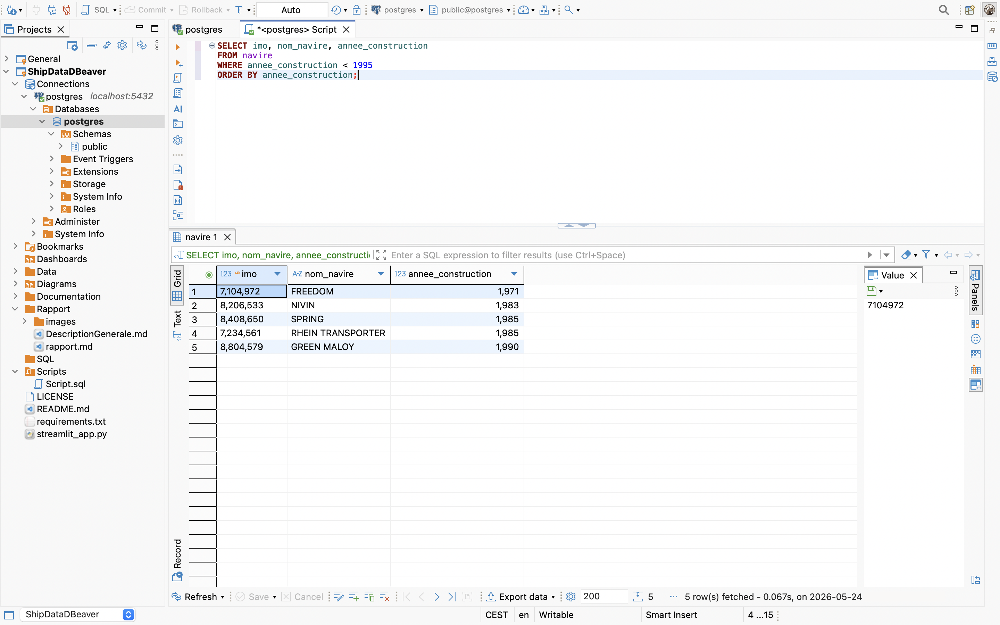

R01) Liste des navires avec leur type, catégorie et pavillon

Cette requête donne une vue plus complète des navires. Au lieu d’afficher seulement les identifiants, elle récupère aussi le type du navire, sa catégorie principale et son pavillon. Elle utilise donc plusieurs jointures autour de la table navire. C’est une requête importante, parce qu’elle montre que les liens entre les tables principales fonctionnent correctement.

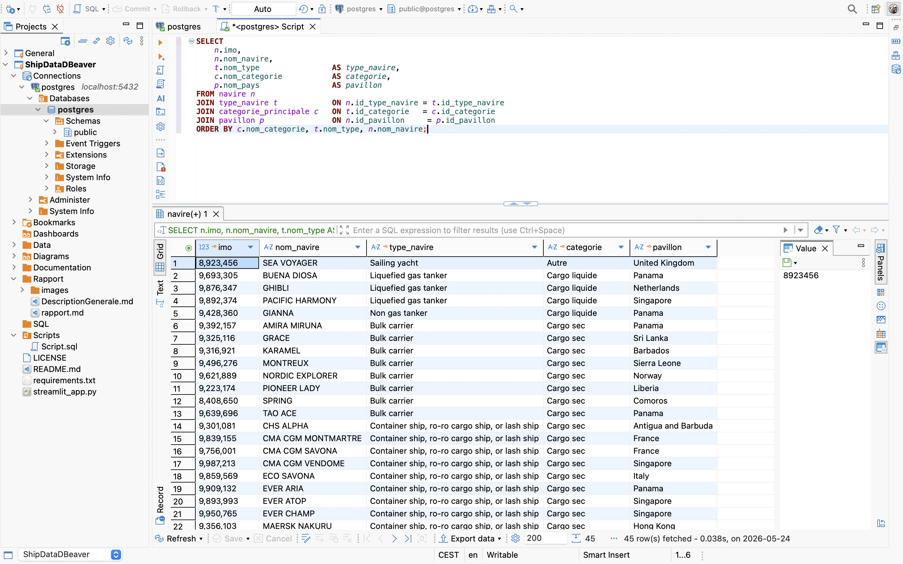

R02) Nombre de navires par catégorie principale

Cette requête compte combien de navires appartiennent à chaque catégorie principale. Elle permet de voir quelles catégories sont les plus présentes dans notre base. Par exemple, on peut rapidement voir si l’échantillon contient surtout des navires de charge, des navires spécialisés ou d’autres types de navires.

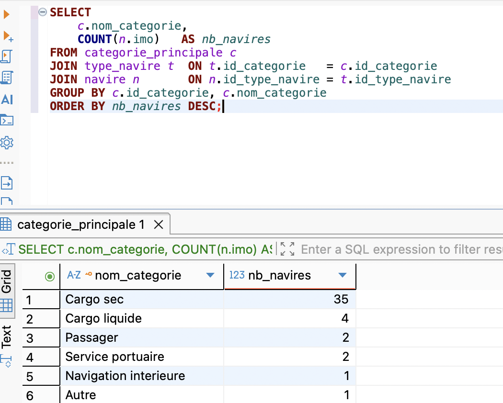

R03) Ports les plus fréquentés

Cette requête affiche les cinq ports qui apparaissent le plus souvent dans les escales. Elle permet de comprendre quels ports sont les plus représentés dans les données. Elle montre aussi le lien entre les tables port et escale, puisque chaque escale doit être associée à un port existant.

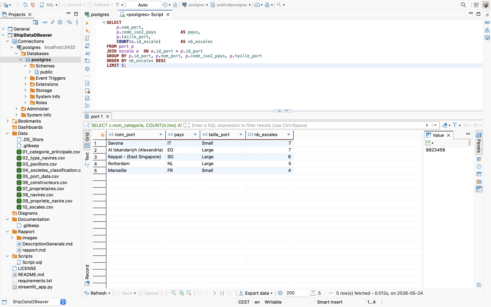

R04) Historique des propriétaires du navire CHS ALPHA

Cette requête affiche les propriétaires successifs du navire CHS ALPHA. Elle donne les dates de début et de fin de propriété, puis ajoute un statut pour distinguer les anciens propriétaires du propriétaire actuel. Si la date de fin est NULL, cela signifie que le propriétaire est encore actif. Cette requête montre bien l’intérêt de la table propriete_navire.

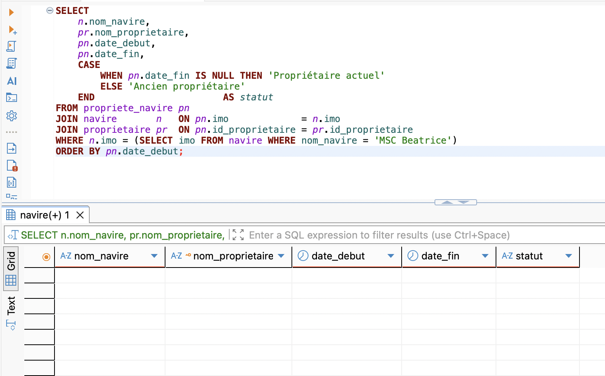

R05) Navires ayant eu plusieurs propriétaires

Cette requête recherche les navires qui ont changé de propriétaire au moins une fois. Elle regroupe les lignes par navire et garde seulement ceux qui ont plusieurs propriétaires dans leur historique. Elle est utile parce qu’elle montre que la base ne stocke pas seulement l’état actuel, mais aussi une partie de l’évolution dans le temps.

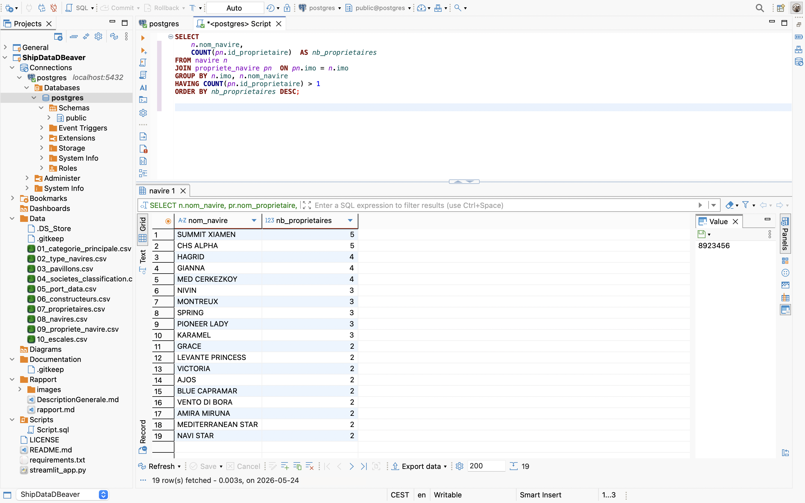

R06) Statistiques par pavillon

Cette requête calcule plusieurs informations pour chaque pavillon : le nombre de navires, le gross tonnage moyen et le port en lourd moyen. Elle permet donc de comparer les pavillons entre eux, pas seulement en quantité, mais aussi selon les caractéristiques moyennes des navires associés.

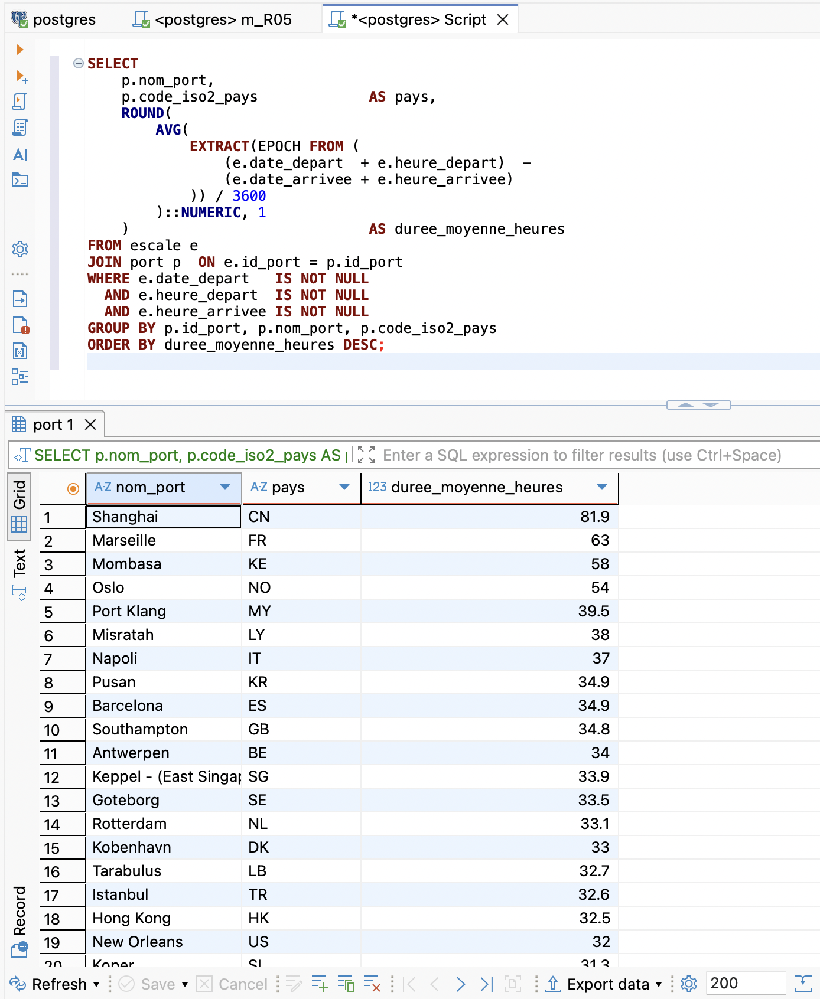

R07) Navires classés par DNV

Cette requête affiche les navires associés à la société de classification DNV. Elle permet de filtrer les navires selon leur société de classification, puis de les trier par gross tonnage. C’est une manière simple de montrer comment la base peut être utilisée pour retrouver les navires liés à un organisme précis.

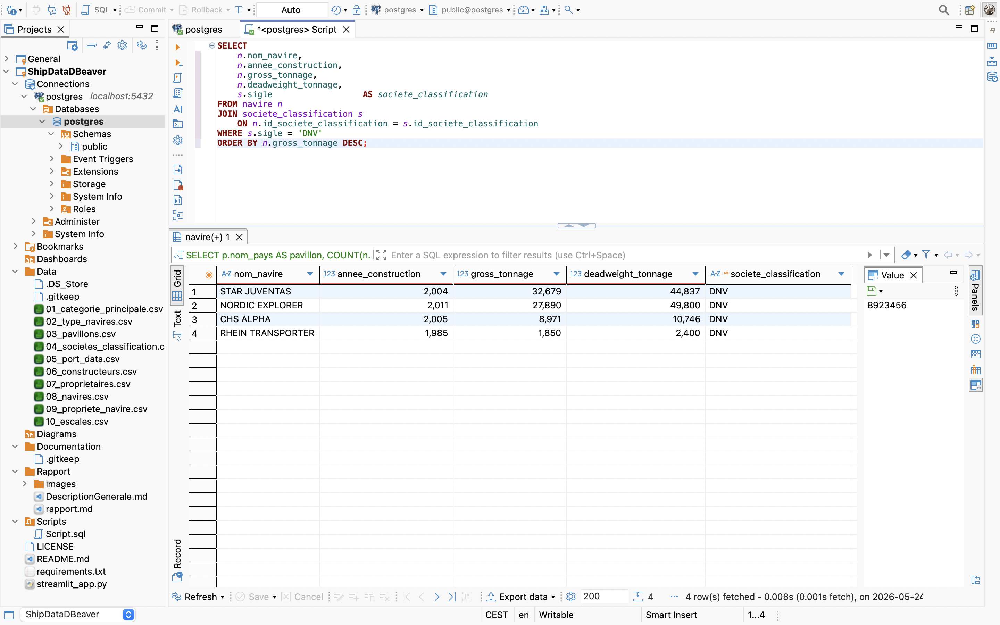

R08) Âge moyen des navires par type

Cette requête calcule l’âge moyen des navires pour chaque type de navire, en prenant 2026 comme année de référence. Elle permet de comparer les types de navires selon leur ancienneté moyenne. On peut ainsi voir quels types regroupent des navires plutôt récents ou plutôt anciens.

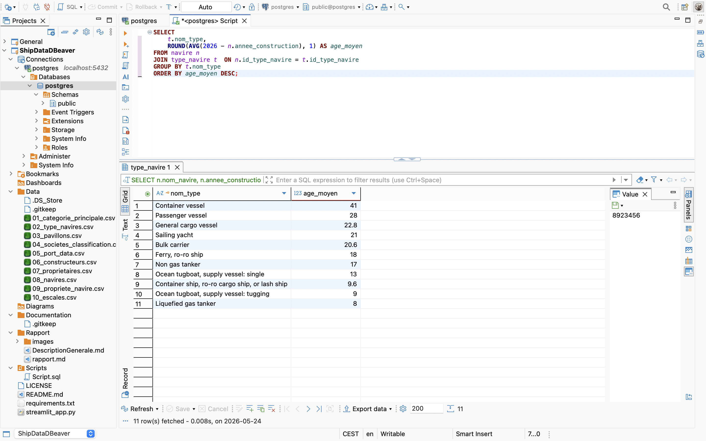

R09) Classement des navires par tonnage dans chaque catégorie

Cette requête classe les navires à l’intérieur de leur catégorie principale selon leur gross tonnage. Elle utilise une fonction de fenêtre avec RANK, ce qui permet de créer un classement sans perdre le détail de chaque navire. C’est une requête un peu plus avancée, mais elle reste facile à interpréter.

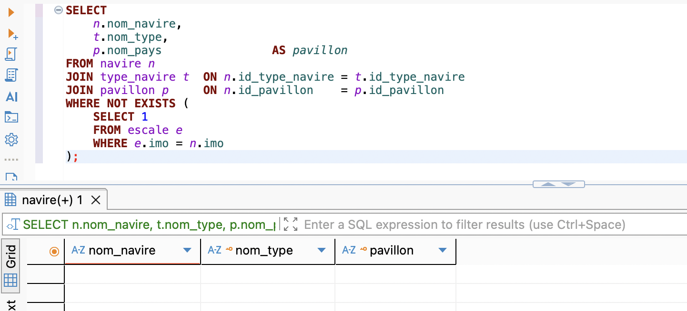

R10) Escales du navire NIVIN

Cette requête affiche les escales du navire NIVIN. On peut voir les ports visités, ainsi que les dates d’arrivée et de départ. Elle permet de suivre l’activité d’un navire précis dans la base, et de vérifier le lien entre navire, escale et port.

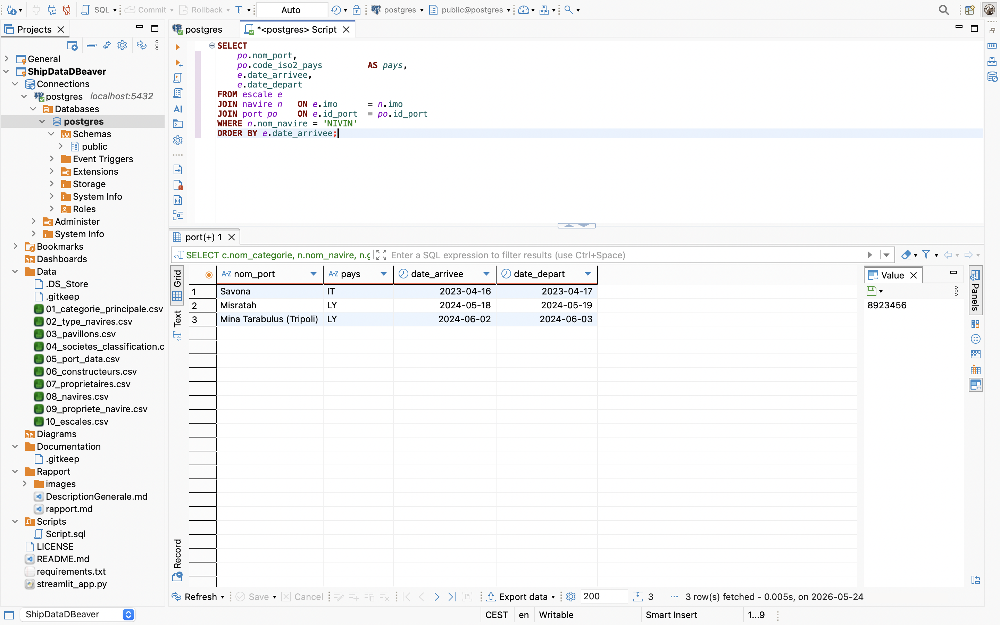

R11) Escales au port de Savona sur une période donnée

Cette requête recherche les navires passés par le port de Savona entre le 15 et le 18 avril 2023. Elle montre comment on peut filtrer les escales avec deux critères à la fois : un lieu précis et une période donnée. C’est typiquement le genre de requête utile pour suivre l’activité d’un port sur quelques jours.

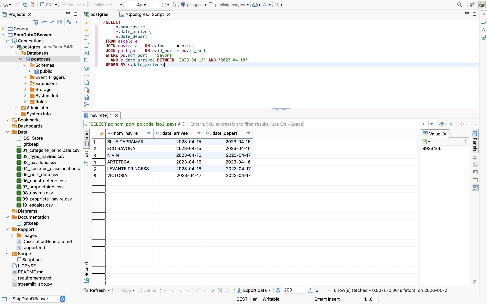

R12) Historique détaillé des propriétaires de NIVIN

Cette requête affiche l’historique des propriétaires du navire NIVIN à partir de son numéro IMO. Elle montre les propriétaires successifs, leur pays, leur année de création, ainsi que les dates de début et de fin de propriété. Dans notre cas, elle permet aussi de voir que ALAME Export SA est le propriétaire actuel, puisque la date de fin est NULL.

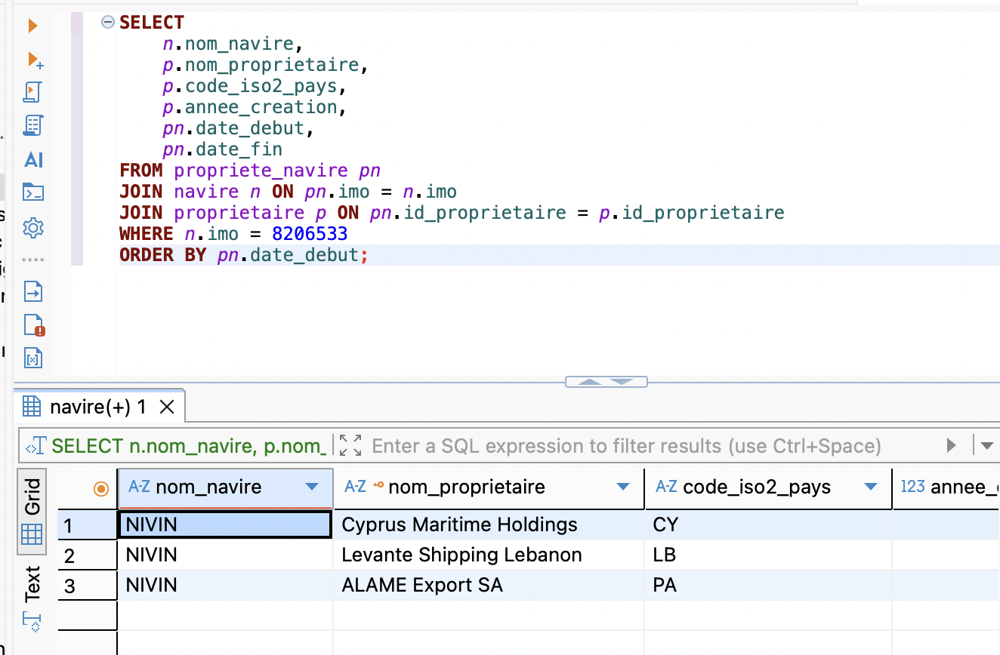

R13) Nombre de navires par pavillon

Cette requête compte le nombre de navires pour chaque pavillon. Elle ressemble un peu à R06, mais elle est plus simple. Ici, on cherche seulement à savoir quels pavillons sont les plus fréquents dans la base, sans calculer de moyennes sur les tonnages.

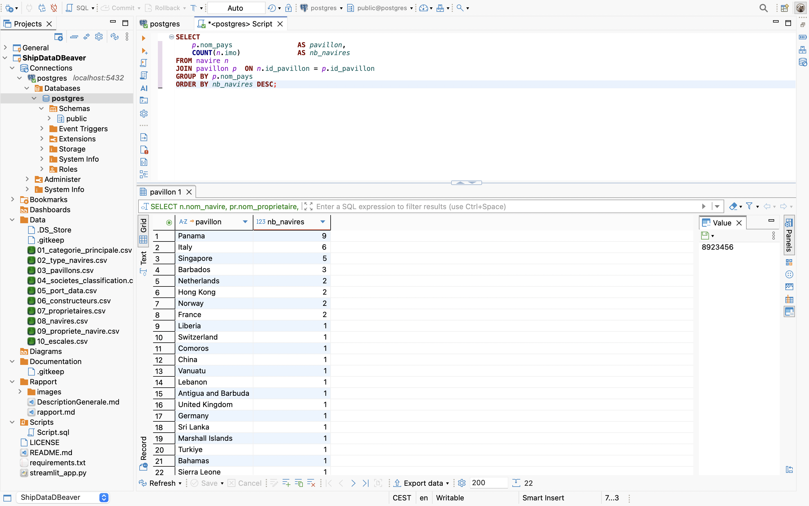

## Conclusion

Avec ShipData, nous avons construit une base de données autour d’un domaine concret : le transport maritime. L’idée était de partir de données sur des navires, des ports, des propriétaires, des constructeurs et des escales, puis de les organiser dans une structure plus claire.

Ce qui a pris le plus de place, ce n’était pas seulement de créer les tables. C’était surtout de rendre tout cohérent. Les fichiers CSV devaient correspondre aux tables SQL. Les clés étrangères devaient bien relier les données. Les contraintes devaient aussi éviter les erreurs trop évidentes. On s’est rendu compte que dans une base de données, un petit décalage dans un nom de colonne ou dans un type de donnée peut vite bloquer tout le reste.

Les requêtes SQL montrent que la base peut vraiment être utilisée. On peut retrouver l’historique des propriétaires d’un navire, voir les ports les plus fréquentés, comparer les navires selon leur tonnage, ou encore analyser les sociétés de classification et les pavillons. Ce ne sont donc pas juste des tables remplies, mais une base qu’on peut interroger pour obtenir des informations utiles.

Au final, ShipData reste une version simplifiée du monde maritime. Mais c’est justement ce qui la rend lisible. La base représente les éléments principaux du domaine, sans devenir trop lourde. Elle pourrait être enrichie plus tard avec plus de données ou de nouvelles tables, par exemple sur les cargaisons ou les routes maritimes. Mais dans son état actuel, elle remplit déjà son objectif : organiser des données maritimes de manière propre, cohérente et exploitable.

## Bibliographie et sources

BICS (2026) Vessel Type Chart. Consulté le 07 mai 2026, utilisé le 24 mai 2026. Disponible à l’adresse : https://www.bics.nl/sites/default/files/Documents/EN/Vessel%20type%20chart.pdf

ISO (2026) ISO Online Browsing Platform, ISO 3166 Country Codes. Consulté le 07 mai 2026, utilisé le 24 mai 2026. Disponible à l’adresse : https://www.iso.org/obp/ui/#iso:code:3166:PA

NIMASA (2026) List of Approved Classification Societies. Consulté le 07 mai 2026, utilisé le 24 mai 2026. Disponible à l’adresse : https://nimasa.gov.ng/wp-content/uploads/2019/08/LIST-OF-APPROVED-CLASSIFICATION-SOCIETIES.pdf

Fabled Sky Research (2026) Global Maritime Port Database. Figshare. Consulté le 07 mai 2026, utilisé le 24 mai 2026. Disponible à l’adresse : https://figshare.com/articles/dataset/Global_Maritime_Port_Database_-_Fabled_Sky_Research/26198441?file=47476661

VesselFinder (2026) Vessel information database. Consulté le 07 mai 2026, utilisé le 24 mai 2026. Disponible à l’adresse : https://www.vesselfinder.com/

Ralyté, J. (2026) MSIS Chapitre 3 : Le concept de classe. Université de Genève, Centre Universitaire d’Informatique.