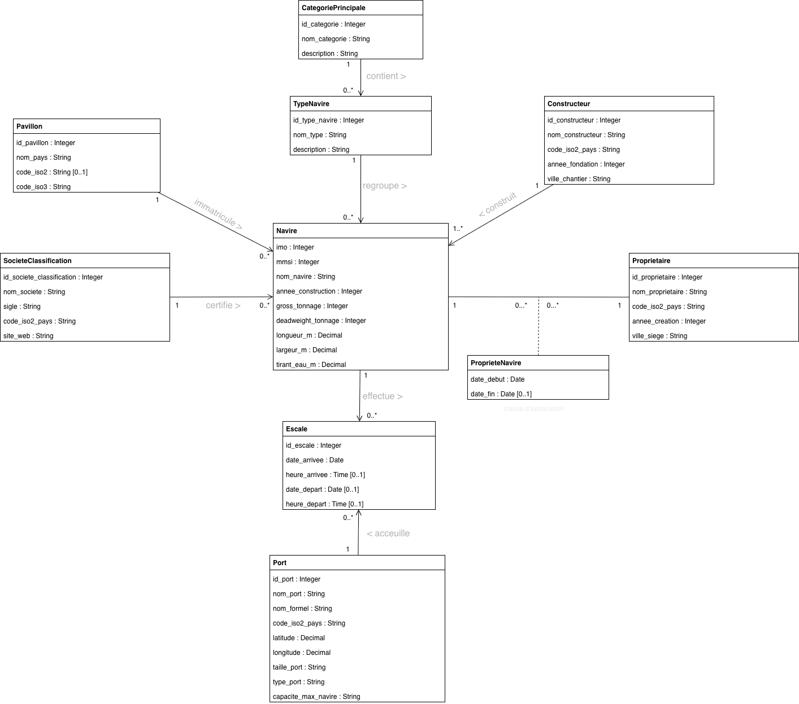

## Description générale du projet

ShipData est une base de données relationnelle dédiée au transport maritime. L'idée de départ était simple: ce domaine est extrêmement structuré dans la réalité, chaque navire a un identifiant unique (le numéro IMO), un pavillon, un ou plusieurs propriétaires au fil du temps, un constructeur, une société qui le certifie, et une histoire de déplacements à travers les ports du monde. Il nous a  donc semblé naturel d'en faire le sujet de notre projet.

La base stocke des informations sur 45 navires, répartis en 12 types regroupés en 8 catégories principales (vraquiers, porte-conteneurs, pétroliers, navires de croisière, etc…). Pour chaque navire, on retrouve ses caractéristiques techniques (tonnage, dimensions, tirant d'eau) ainsi que son pavillon d'immatriculation parmi 114 pays, sa société de classification parmi 20 organismes internationaux, et son chantier naval parmi 18 constructeurs. L'historique de propriété est représenté dans une table dédiée, ce qui permet de suivre les transferts de propriété d'un navire dans le temps. Et enfin, 96 escales dans 110 ports répartis dans le monde permettent d'analyser les déplacements et l'activité des navires.

L'usage principal de ShipData est la consultation et l'analyse de données maritimes. On peut par exemple identifier les pavillons les plus représentés dans la flotte, comparer les navires selon leur tonnage ou leurs dimensions, retrouver les ports les plus fréquentés, suivre l'historique de propriété d'un navire particulier, ou encore analyser les escales par type de port ou par région (qu’on démontrera à l’aide des requêtes SQL). La base transforme ainsi des données dispersées en informations lisibles et exploitables, de manière à ce que ce soit accessible pour tous.

En parlant des utilisateurs, les cibles sont variées. On pourrait avoir un analyste maritime souhaitant étudier une flotte de navires ou bien un agent portuaire consultant l'historique des passages dans son port ou encore un gestionnaire de flotte suivant les navires sous sa responsabilité. Dans le cadre de ce projet, une partie des données provient de sources réelles et a été nettoyée, tandis que d'autres ont été générées de façon fictive mais réaliste afin d'obtenir une base suffisamment complète pour produire des requêtes intéressantes.

## Diagramme de classe UML

*Figure 1: Diagramme de classes UML 
Nous l'avons fait sur draw.io et il présente les principales entités de la base de données ainsi que leurs relations : navires, types de navires, pavillons, sociétés de classification, constructeurs, propriétaires, ports et escales. La classe d’association ProprieteNavire permet de représenter l’historique des propriétaires d’un navire dans le temps*

## Définition des attributs

Évidemment, pas tout le monde connait le monde maritime donc les tableaux suivants présentent les attributs de chaque table de la base ShipData. Pour chaque attribut, il y a son nom, sa signification et son domaine de valeurs. Le domaine précise le type de donnée attendu ainsi que certaines contraintes importantes, comme les valeurs positives, les formats de date ou les références vers d’autres tables

### categorie_principale

| Attribut | Domaine | Contraintes | Définition |
|---|---|---|---|
| id_categorie | Integer | PK, NOT NULL | Identifiant unique de la catégorie principale |
| nom_categorie | VARCHAR(100) | NOT NULL, UNIQUE | Nom de la catégorie générale du navire (ex. Cargo sec, Passager) |
| description | VARCHAR(500) | NOT NULL | Description textuelle |

---

### type_navire

| Attribut | Domaine | Contraintes | Définition |
|---|---|---|---|
| id_type_navire | Integer | PK, NOT NULL | Identifiant unique du type de navire |
| nom_type | VARCHAR(150) | NOT NULL, UNIQUE | Nom précis du type de navire (ex. Container ship, Bulk carrier) |
| id_categorie | Integer | NOT NULL, FK -> categorie_principale | Catégorie principale à laquelle appartient le type |
| description | VARCHAR(500) | NOT NULL | Description du type de navire |

---

### pavillon

| Attribut | Domaine | Contraintes | Définition |
|---|---|---|---|
| id_pavillon | Integer | PK, NOT NULL | Identifiant unique du pavillon |
| nom_pays | VARCHAR(100) | NOT NULL, UNIQUE | Nom du pays d'immatriculation |
| code_iso2 | CHAR(2) | UNIQUE (partiel) | Code ISO 3166-1 alpha-2 du pays + NULL admis (car Namibie = NA) |
| code_iso3 | CHAR(3) | NOT NULL, UNIQUE | Code ISO 3166-1 alpha-3 du pays |

---

### societe_classification

| Attribut | Domaine | Contraintes | Définition |
|---|---|---|---|
| id_societe_classification | Integer | PK, NOT NULL | Identifiant unique de la société de classification |
| nom_societe | VARCHAR(150) | NOT NULL, UNIQUE | Nom complet de la société (ex. Bureau Veritas) |
| sigle | VARCHAR(20) | NOT NULL, UNIQUE | Sigle officiel de la société (ex. BV, DNV, LR) |
| code_iso2_pays | CHAR(2) | NOT NULL | Code ISO du pays de la société |
| site_web | VARCHAR(500) |  / | URL du site officiel de la société |

---

### port

| Attribut | Domaine | Contraintes | Définition |
|---|---|---|---|
| id_port | Integer | PK, NOT NULL | Identifiant unique du port |
| nom_port | VARCHAR(150) | NOT NULL | Nom courant du port (ex. Savona) |
| nom_formel | VARCHAR(200) | NOT NULL, UNIQUE | Nom officiel complet du port (ex. Port of Beirut) |
| code_iso2_pays | CHAR(2) | NOT NULL | Code ISO du pays où se situe le port |
| latitude | NUMERIC(9,6) | NOT NULL | Latitude géographique du port (entre -90 et 90) |
| longitude | NUMERIC(9,6) | NOT NULL | Longitude géographique du port (entre -180 et 180) |
| taille_port | VARCHAR(50) | NOT NULL, CHECK | Taille du port : Very Small, Small, Medium ou Large |
| type_port | VARCHAR(100) | NOT NULL, CHECK | Type d'infrastructure portuaire (8 valeurs possibles) |
| capacite_max_navire | VARCHAR(50) | CHECK | Capacité maximale d'accueil : Under 500' ou Over 500' |

---

### constructeur

| Attribut | Domaine | Contraintes | Définition |
|---|---|---|---|
| id_constructeur | Integer | PK, NOT NULL | Identifiant unique du chantier naval |
| nom_constructeur | VARCHAR(150) | NOT NULL, UNIQUE | Nom du chantier naval constructeur |
| code_iso2_pays | CHAR(2) | NOT NULL | Code ISO du pays où se situe le chantier |
| annee_fondation | Integer | NOT NULL, CHECK (1700–2030) | Année de fondation du chantier naval |
| ville_chantier | VARCHAR(100) | NOT NULL | Ville où est établi le chantier naval |

---

### proprietaire

| Attribut | Domaine | Contraintes | Définition |
|---|---|---|---|
| id_proprietaire | Integer | PK, NOT NULL | Identifiant unique du propriétaire |
| nom_proprietaire | VARCHAR(150) | NOT NULL, UNIQUE | Nom de l'entreprise ou organisation propriétaire |
| code_iso2_pays | CHAR(2) | NOT NULL | Code ISO du pays du propriétaire |
| annee_creation | Integer | NOT NULL, CHECK (1700–2030) | Année de création de l'organisation propriétaire |
| ville_siege | VARCHAR(100) | NOT NULL | Ville du siège social |

---

### navire

| Attribut | Domaine | Contraintes | Définition |
|---|---|---|---|
| imo | Integer | PK, NOT NULL, CHECK (7 chiffres) | IMO = identifiant maritime international|
| mmsi | Integer | NOT NULL, UNIQUE, CHECK (9 chiffres) | MMSI = identifiant radio du navire |
| nom_navire | VARCHAR(150) | NOT NULL | Nom commercial du navire |
| id_type_navire | Integer | NOT NULL, FK -> type_navire | Type de navire |
| id_pavillon | Integer | NOT NULL, FK -> pavillon | Pavillon d'immatriculation du navire |
| annee_construction | Integer | NOT NULL, CHECK (1900–2030) | Année de mise en service du navire |
| gross_tonnage | Integer | NOT NULL, CHECK > 0 | Tonnage brut = mesure du volume total du navire (en tonneaux) |
| deadweight_tonnage | Integer | NOT NULL, CHECK ≥ 0 | Port en lourd = charge maximale transportable (en T) |
| longueur_m | NUMERIC(6,2) | NOT NULL, CHECK > 0 | Longueur hors-tout du navire en mètres |
| largeur_m | NUMERIC(6,2) | NOT NULL, CHECK > 0 | Largeur maximale du navire en mètres |
| tirant_eau_m | NUMERIC(5,2) | NOT NULL, CHECK > 0 | Tirant d'eau maximal du navire en mètres |
| id_societe_classification | Integer | NOT NULL, FK -> societe_classification | Société de classification certifiant le navire |
| id_constructeur | Integer | NOT NULL, FK -> constructeur | Chantier naval ayant construit le navire |

---

### propriete_navire

| Attribut | Domaine | Contraintes | Définition |
|---|---|---|---|
| imo | Integer | PK, NOT NULL, FK -> navire | Référence au navire concerné |
| id_proprietaire | Integer | PK, NOT NULL, FK -> proprietaire | Référence au propriétaire |
| date_debut | Date | PK, NOT NULL | Date de début de la période de propriété |
| date_fin | Date | CHECK (date_fin > date_debut) | Date de fin de la période de propriété & NULL si propriétaire actuel |

---

### escale

| Attribut | Domaine | Contraintes | Définition |
|---|---|---|---|
| id_escale | Integer | PK, NOT NULL | Identifiant unique de l'escale |
| imo | Integer | NOT NULL, FK -> navire | Référence au navire ayant effectué l'escale |
| id_port | Integer | NOT NULL, FK -> port | Référence au port visité |
| date_arrivee | Date | NOT NULL | Date d'arrivée du navire dans le port. Format YYYY-MM-DD|
| heure_arrivee | Time | / | Heure d'arrivée du navire dans le port. Format HH:MM:SS|
| date_depart | Date | CHECK (date_depart ≥ date_arrivee) | Date de départ du navire & NULL si escale en cours. Format YYYY-MM-DD|
| heure_depart | Time | / | Heure de départ du navire du port. Format HH:MM:SS|
